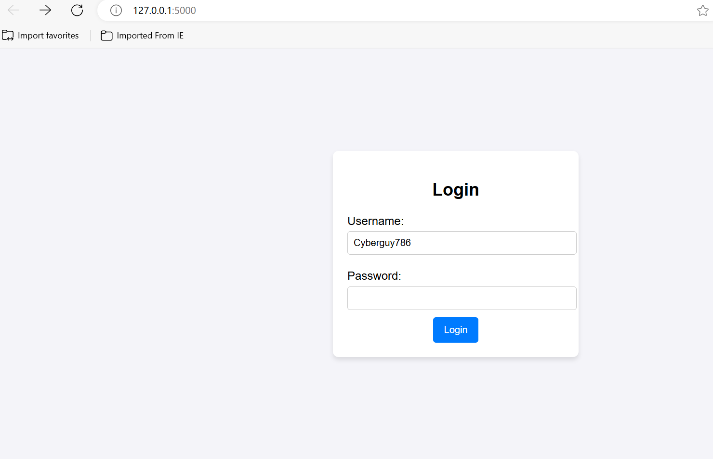

# Phishing Simulation Project

## Description
This project simulates a phishing attack to demonstrate how easily user credentials can be collected through a fake login page. The application is built using Python with the Flask web framework. It mimics a login form and stores submitted credentials in a text file for educational purposes only. This simulation highlights the risks of phishing attacks and aims to raise awareness about cybersecurity threats.

## Tools Used
- **Python 3.7+**: Programming language used for the backend logic.
- **Flask**: A lightweight web framework for creating web applications.
- **HTML**: For creating the structure of the fake login page.
- **CSS**: To style the login page and make it look more legitimate.
- **Text file**: Used to collect and log user credentials for demonstration purposes.
- **Visual Studio Code**: The code editor used to write and manage the project files.

## How the Project Works

### 1. **Project Setup**
   The project was developed using **Visual Studio Code (VS Code)** I created the project folder called `phishing_simulation` and set up the following structure:
   - `app.py`: The main Python file that runs the Flask application.
   - `templates/login.html`: The HTML file containing the fake login page.
   - `static/style.css`: The CSS file used to style the login page.
   - `collected_data.txt`: A text file used to store the credentials submitted by the users.

### 2. **Building the Flask Web Server**
   The application is powered by the Flask framework, which I used to create routes and serve the login page. The main route (`/`) serves the login page, while the `/submit` route handles the form submission. After the user submits their credentials, they are logged into `collected_data.txt` for demonstration purposes.

   I structured the application into routes:
   - `@app.route('/')`: This route serves the fake login page to the user.
   - `@app.route('/submit')`: This route processes the submitted username and password, logging them into a text file.

### 3. **Creating the Login Page**
   The login page is a simple HTML form with fields for the username and password. This page looks like a legitimate login form, tricking users into entering their credentials. The form sends the data to the `/submit` route for processing when the user clicks the "Login" button.

### 4. **Styling the Page**
   I used CSS to style the login page to make it appear more realistic. The CSS adds basic styling such as background color, padding, and hover effects for the submit button to make the form look more like an actual login page.

### 5. **Testing and Running the Project**
   After building the Flask server, HTML, and CSS files, I tested the project by running the Flask app locally on `http://127.0.0.1:5000`. I entered dummy login credentials into the form and checked the `collected_data.txt` file to verify that the credentials were saved correctly.

## How to Avoid Phishing Attacks

1. **Verify Website URL**: Always check the URL of the website you're visiting, especially if it's asking for sensitive information like login credentials or credit card details. Official websites will have a secure "HTTPS" connection and a valid SSL certificate.
   
2. **Beware of Suspicious Emails or Messages**: Phishing often starts with unsolicited emails or messages that encourage you to click on a link or download an attachment. Always verify the sender before clicking any links.
   
3. **Two-Factor Authentication (2FA)**: Enable 2FA on your online accounts whenever possible. Even if your credentials are compromised, 2FA adds an extra layer of security.

4. **Check for Typos**: Phishing websites often contain subtle errors such as misspelled words or improper formatting. Pay attention to the details.

5. **Use Password Managers**: Password managers help you create strong, unique passwords for each of your accounts, and can automatically fill out login forms to prevent phishing attempts.

## Screenshots

### 1. **Fake Login Page**
   

### 2. **Form Submission Confirmation**
   

## Ethical Considerations
This project is **intended for educational purposes only** to demonstrate the dangers of phishing and raise awareness about cybersecurity.

## Running the Project
1. Clone this repository to your local machine.
2. Navigate to the project directory:
   ```bash
   cd phishing_simulation
3. Install Flask
   pip install flask
4. Run Flask
   python app.py
5. Open a web browser and visit http://127.0.0.1:5000 to interact with the phishing simulation.

## Conclusion
This project is a great way to understand how phishing attacks work and how attackers can exploit vulnerabilities. By learning about these threats, we can better protect ourselves from cybercriminals.
